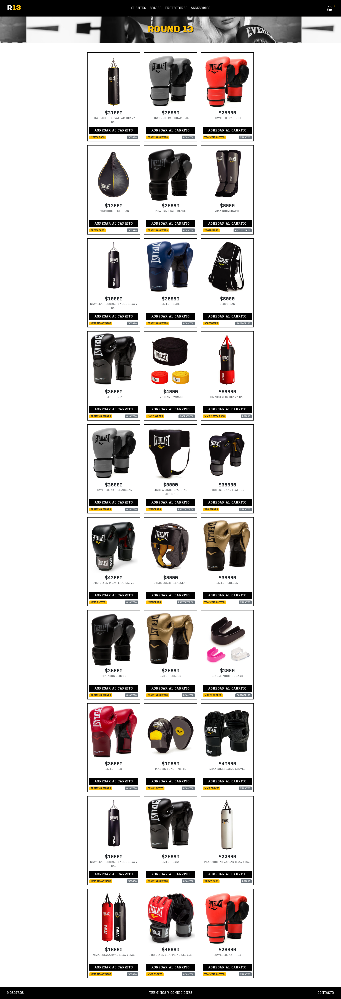

<h1>ROUND13</h1>

  

React E-commerce app
<h2>General Information</h2>

<ul>
<li>E-commerce app to be able to sell boxing products.</li>
</ul><ul>
<li>Allows purchasing products over the internet.</li>
</ul><ul>
<li>Allows global buyers to do business in a seamless and easy way.</li>
</ul><h2>Technologies Used</h2>

<ul>
<li>HTML</li>
</ul><ul>
<li>CSS</li>
</ul><ul>
<li>JavaScript</li>
</ul><ul>
<li>React</li>
</ul><ul>
<li>NodeJS</li>
</ul><h2>Features</h2>

<ul>
<li>Simple UI</li>
</ul><ul>
<li>Native project ready to be built on to your device.</li>
</ul><ul>
<li>Support for unimodules and auto-linking.</li>
</ul><ul>
<li>Full support for React Native web.</li>
</ul><ul>
<li>TypeScript by default.</li>
</ul>
<h2>Screenshoot</h2>

<h2>Setup</h2>

Followig are the requirements to run this project:
Node Package Manager (NPM) and React
<h5>Steps</h5><ul>
<li>Installation:  npm install</li>
</ul><ul>
<li>To Start Server:  npm start</li>
</ul><h2>Usage</h2>

Clone down this repository. You will need node and npm installed globally on your machine.
<h5>Code Examples</h5><ul>
<li>Clone the repo:</li>
</ul>
<code>git clone https://github.com/martinmatus100/round13.git</code>
<ul>
<li>Installation NPM:</li>
</ul>
<code>npm install</code>
<ul>
<li>To Start Server:</li>
</ul>
<code>npm start</code>
<h2>Project Status</h2>

Completed and open for your contributions.
<h2>Acknowledgement</h2>

<ul>
<li>This project was inspired by the Everlast store</li>
</ul><ul>
<li>This project was based on the official React documentation.</li>
</ul><ul>
<li>Many thanks to Manuel Adan</li>
</ul><h2>Contact</h2>

